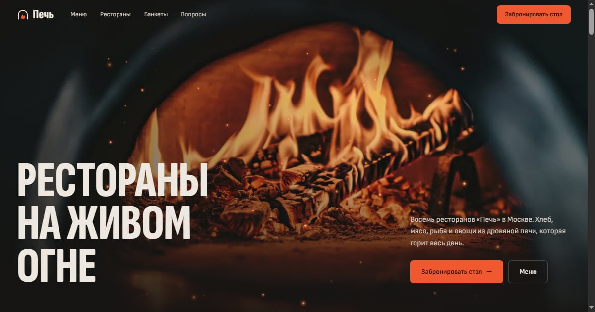

# Печь — сайт сети ресторанов

Сайт сети из восьми ресторанов на живом огне: меню, ближайший адрес на схеме Москвы и бронь
стола в несколько шагов.

**Живое демо → https://automatorr192-dev.github.io/pech/**

## Что внутри

- Меню с фотографиями блюд: на компьютере большое фото появляется при наведении.
- Восемь адресов на схеме города, у каждого «открыто сейчас» по московскому времени и
  кнопка маршрута в Яндекс.Картах.
- Бронь: ресторан, день на неделю вперёд, свободное время по часам работы, число гостей.
  Компанию больше 12 человек сайт предлагает оформить как банкет.
- SEO: title и description под запрос «рестораны на живом огне в Москве», Open Graph,
  разметка JSON-LD для каждого ресторана и FAQ, sitemap и robots.

## Сейчас это демо

Сеть вымышленная. Бронь собирает данные и показывает итог, но никуда не уходит, занятость
столов не учитывается. Следующий шаг — отправка брони в AI-CRM и уведомление ресторану.

## Стек

HTML · CSS · JavaScript без фреймворка · GitHub Pages

Сборки нет: сайт открывается прямо из папки.
